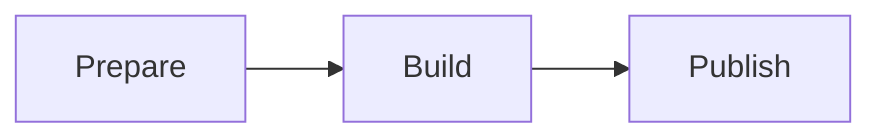
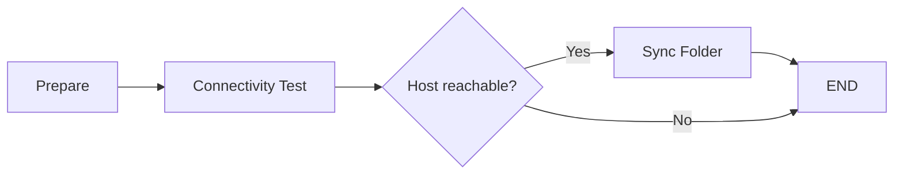
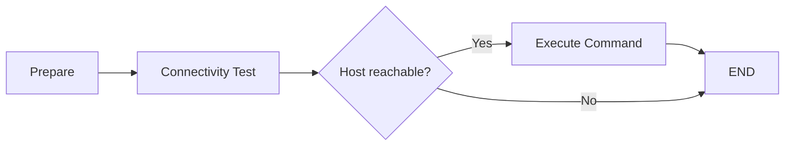

# Jenkins Library
_Shared library for training and device maintenance purposes._

## Table of Contents
1. [Project Structure](#Project%20Structure)
2. [Pipelines](#Pipelines)
3. [Utils](#Utils)
4. [Plugins](#Plugins)

## Project Structure
~~~text
(root)
+- resources                                # Resources (configuration files, Dockerfiles..)
|   +- configuration.json
|   +- Dockerfile
|   +- keys
|       +- ssh_keys.pub
|   +- ...
+- src                                      # Groovy source files (Classes)
|   +- com
|       +- rdvl
|           +- jenkinsLibrary
|               +- technologies
|                   +- Docker.groovy
|                   +- Golang.groovy
|               +- Host.groovy
|               +- Project.groovy
|               +- ...
+- vars                                     # Pipelines
|   +- build_and_publish.groovy
|   +- rsync_backup.groovy
|   +- ssh_command.groovy
|   +- ...
~~~

## Pipelines
### Build and Publish
Builds and publish any project configured in configuration.json

#### Docker
Builds root dockerfile and publish built image in its Github repository.

#### Golang
Builds binaries using [Golang Builder](https://github.com/r-dvl/golang-builder) Docker image and attach those binaries to Job Build in Jenkins.

### Rsync Backup
Sync folders configured in configuration.json launching an [Ansible Playbook](https://github.com/r-dvl/ansible-playbooks/tree/master).

### SSH Command
Sends a SSH command to any of the configured hosts in Jenkins.
> Used mainly to program commands with Jenkins Trigger (used as Cron).

## Utils
Jenkins scripts written in vars are instantiated on-demand as singletons. Auxiliary functions and Jenkins wrappers are defined here to being used in pipelines and classes such as _Host.groovy_.

## Plugins
Must install plugins

### Ansible
- [Ansible](https://plugins.jenkins.io/ansible/)

### Docker
- [Docker](https://plugins.jenkins.io/docker-plugin/)
- [Docker Pipeline](https://plugins.jenkins.io/docker-workflow/)
- [CloudBees Docker Build and Publish](https://plugins.jenkins.io/docker-build-publish/)

### Pipeline
- [Pipeline Utility Steps](https://plugins.jenkins.io/pipeline-utility-steps/)
- [SSH Pipeline Steps](https://plugins.jenkins.io/ssh-steps/)

### Other
- [Calendar View](https://plugins.jenkins.io/calendar-view/)
- [AnsiColor](https://plugins.jenkins.io/ansicolor/)

